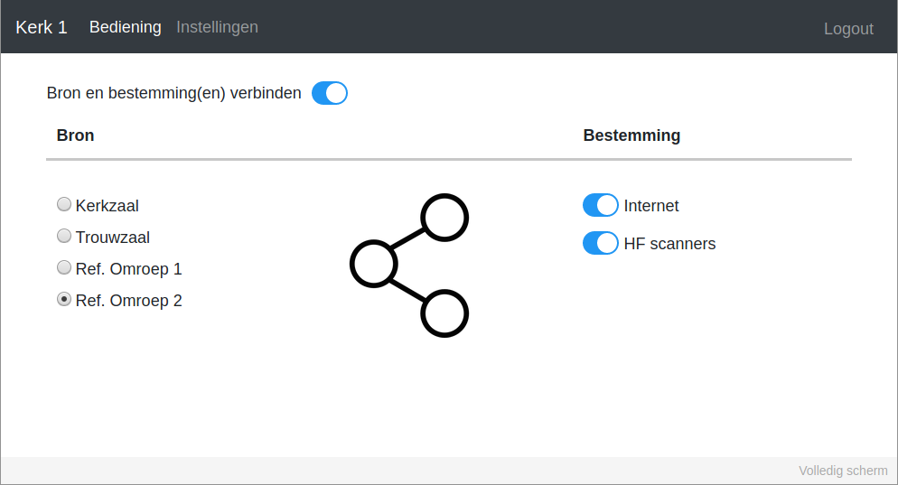
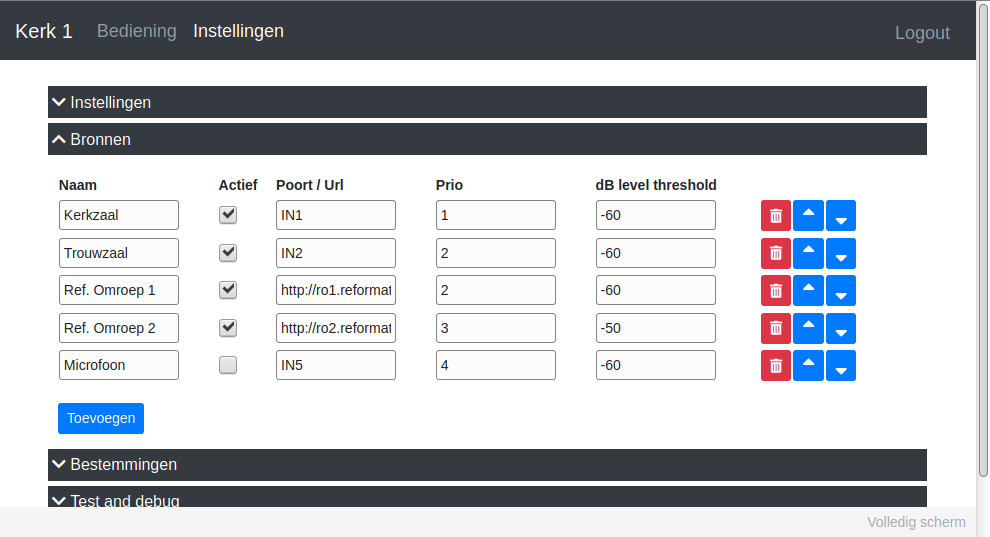

# Introduction

Control the routing of audio using a Raspberry Pi. This software runs on a Raspberry Pi and communicates with an ITEC audio controller (ITEC MultiMix) using the serial port. It provides a webinterface to easily connect an audio input source to multiple audio destinations.

Further, it can read audio from an url, and send it to a configurable input of the ITEC.

The userinferface is created in the Dutch language. It consists of 2 pages; Control and Settings:

